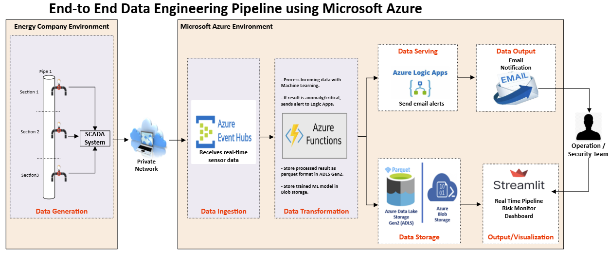
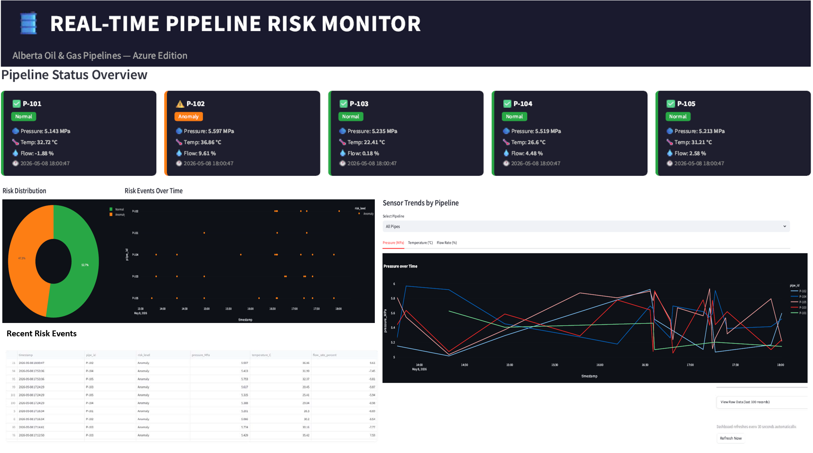
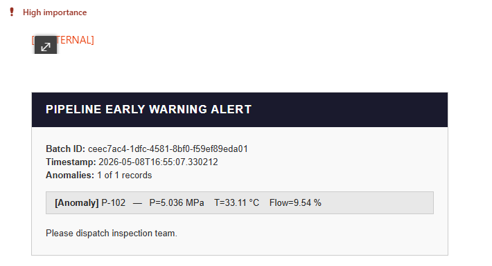
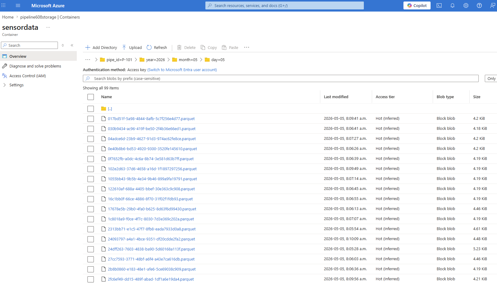

# Real-Time Pipeline Risk Monitoring — Azure

> End-to-end real-time risk detection system for Alberta oil & gas pipelines, built on Microsoft Azure.


---

## Overview

This project streams sensor telemetry from 5 simulated Alberta pipelines into Azure Event Hubs, processes each reading through a trained Random Forest ML model using an Azure Function, stores results as Parquet files in Azure Data Lake Storage Gen2, and sends HTML email alerts via Azure Logic Apps + Gmail when anomalies or critical conditions are detected.

A live Streamlit dashboard displays pipeline status cards, risk distribution, and sensor trends — refreshing automatically every 30 seconds.

---

## End-to-End Pipeline Flow

1. Python simulator generates pipeline telemetry data
2. Azure Event Hubs ingests streaming sensor events
3. Azure Functions processes events in real time
4. ML/rule-based logic classifies Normal, Anomaly, or Critical conditions
5. Processed results are stored in Azure Blob Storage / ADLS Gen2
6. Logic Apps sends alert notifications
7. Streamlit dashboard visualizes live pipeline status

---

## Current Status

✅ Azure Event Hubs configured  
✅ Sensor simulator connected  
✅ Azure Functions processing events  
🔄 Streamlit dashboard integration in progress  
🔄 Logic Apps email alert integration in progress  

---

## Architecture

```text
Sensor Simulator (sensorsim_azure.py)
        │
        │  azure-eventhub SDK
        ▼
Azure Event Hubs  (pipeline-sensor-hub)
        │
        │  Event Hub Trigger
        ▼
Azure Function  (pipeline-processor)
        │                         │
        ▼                         ▼
ADLS Gen2                  Azure Logic Apps
processed_data/            Gmail connector
pipe_id=P-xxx/             HTML email alert
year/month/day/            5 min cooldown
{uuid}.parquet
        │
        ▼
Streamlit Dashboard (localhost:8501)
...
Auto-refresh every 30 seconds
```
> Note: This project uses the native Azure Event Hubs SDK. Kafka surface support is not required for this implementation.


## Azure Architecture Components / Azure Services Used

| Layer | Azure Service | Purpose |
|---|---|---|
| Sensor Simulation | Python Simulator | Generates simulated pipeline telemetry |
| Streaming | Azure Event Hubs (Basic) | Receives/Ingests real-time sensor data |
| Processing | Azure Functions (Flex Consumption) | Processes events, classifies and detects anomalies (Serverless ML inference - Linux, Python 3.11) |
| Storage | Azure Data Lake Storage Gen2 | Stores processed outputs in Parquet format, -partitioned by pipe/date |
| Storage | Azure Blob Storage | Stores trained ML model (Random Forest model) |
| Alerting | Azure Logic Apps | Sends email alerts for anomaly or critical events (HTTP trigger → Gmail → HTML email alert) |
| Monitoring | Azure Monitor / App Insights | Function invocation monitoring |
| Dashboard | Streamlit | Visualizes pipeline status and sensor trends |
| ML Model | scikit-learn Random Forest | Classifies Normal, Anomaly, and Critical events |

---

## Project Structure

```
pipeline-risk-azure/
├── README.md
├── .gitignore
├── .env.example                  # Template for environment variables
├── requirements.txt              # Local dependencies (simulator + dashboard)
├── sensorsim_azure.py            # Sensor data simulator
├── dashboard_azure.py            # Streamlit dashboard
├── pipeline-azure/               # Azure Function App
│   ├── function_app.py           # Function logic (ML inference + alerting)
│   ├── requirements.txt          # Function dependencies
│   ├── host.json                 # Function app configuration
│   └── local.settings.json.example
└── docs/
    └── architecture.md           # Detailed architecture notes
```

---

## Quickstart

### Prerequisites

- Python 3.10 or 3.11
- Azure CLI: `winget install Microsoft.AzureCLI` (Windows) or `brew install azure-cli` (Mac)
- Azure Functions Core Tools v4: [Download MSI](https://aka.ms/installazurefunctionscoretoolsv4)
- Azure for Students account at [portal.azure.com](https://portal.azure.com)

### 1. Clone the repo

```bash
git clone https://github.com/cnero101/Pipeline-Risk-Monitoring-with-Azure.git
cd pipeline-risk-azure
```

### 2. Install dependencies

```bash
pip install -r requirements.txt
```

### 3. Set up environment variables

```bash
cp .env.example .env
# Edit .env and fill in your Azure connection strings
```

### 4. Deploy the Azure Function

```bash
cd pipeline-azure
az login --use-device-code
func azure functionapp publish pipeline-processor
```

### 5. Run the simulator

```bash
cd ..
python sensorsim_azure.py
```

### 6. Run the dashboard

```bash
streamlit run dashboard_azure.py
# Opens at http://localhost:8501
```

---

## ML Model

The risk classification model is a Random Forest classifier trained on historical pipeline sensor data.

| Feature | Description |
|---|---|
| `pressure_MPa` | Pipeline pressure in megapascals |
| `temperature_C` | Temperature in degrees Celsius |
| `flow_rate_percent` | Flow rate deviation (%) |

**Output classes:**
- `0` → Normal
- `1` → Anomaly
- `2` → Critical

The trained model (`random_forest_model.joblib`) is stored in Azure Blob Storage (`modelstore` container) and loaded into memory on the first Function invocation.

---

## Email Alerts

Alerts are sent via Azure Logic Apps + Gmail connector when the ML model detects an Anomaly or Critical reading.

- **Format:** HTML email with batch ID, timestamp, sensor readings, and recommended action
- **Cooldown:** 5 minutes per pipeline to prevent inbox flooding
- **Anomaly action:** Dispatch inspection team
- **Critical action:** Immediate shutdown — dispatch maintenance team

---

## Dashboard Features

- Pipeline status cards (one per pipeline — colour-coded green/orange/red)
- KPI row: total records, pipes monitored, Normal / Anomaly / Critical counts
- Risk distribution donut chart
- Risk events over time scatter plot
- Sensor trend line charts (pressure, temperature, flow rate) with per-pipe filter
- Recent risk events table
- Auto-refresh every 30 seconds via `streamlit-autorefresh`

---

## Azure Resource Setup

All resources live inside a single resource group for easy cleanup:

```bash
# Create resource group
az group create --name pipeline-monitoring-rg --location eastus2

# Clean up everything when done
az group delete --name pipeline-monitoring-rg
```

See [`docs/architecture.md`](docs/architecture.md) for full step-by-step setup instructions.

---

## Security

**Never commit connection strings or secrets to GitHub.**

- All secrets are stored as environment variables (see `.env.example`)
- Azure Function secrets are set via Azure Portal → Environment Variables
- The `.gitignore` excludes `.env` and `local.settings.json`

---

## Cost

This project is designed to run within Azure for Students with careful usage, small workloads, and cleanup of unused resources:

| Service | Free Limit | Project Usage |
|---|---|---|
| Azure Functions | 1M executions/month | ~86,400/day |
| Azure Event Hubs (Basic) | 10M events/month | ~432,000/day |
| Azure Blob / ADLS | 5 GB for 12 months | ~10 MB/day |
| Azure Logic Apps | ~4,000 actions/month | 1 per alert |

---

## Tech Stack

- **Python 3.11** — all components
- **azure-eventhub** — sensor data streaming
- **azure-storage-blob** — ADLS Gen2 read/write
- **azure-functions** — Function App runtime
- **scikit-learn** — Random Forest classifier
- **pandas + pyarrow** — Parquet file handling
- **streamlit + plotly** — dashboard
- **streamlit-autorefresh** — 30-second auto-refresh

---

## Screenshots

### Azure Architecture


### Streamlit Dashboard


### Email Alert


### Blob Storage Output


---

## Future Improvements

- Real IoT sensor integration
- Computer vision monitoring using CCTV/drone feeds
- Geospatial pipeline visualization
- Multi-region deployment
- Automated incident reporting

---

## License

MIT License — see [LICENSE](LICENSE) for details.
